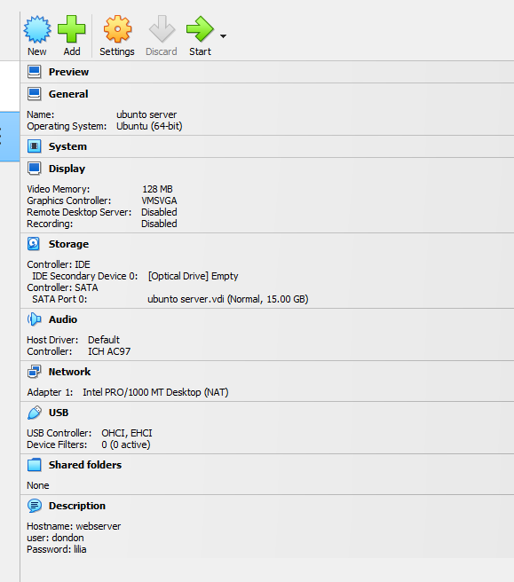
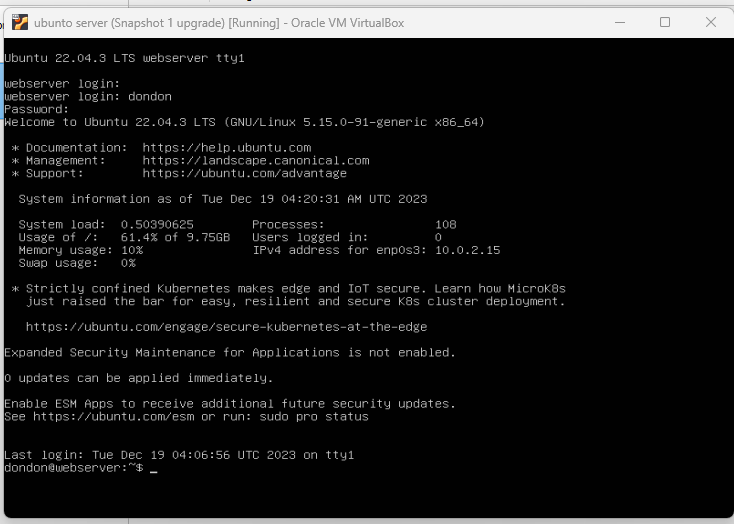
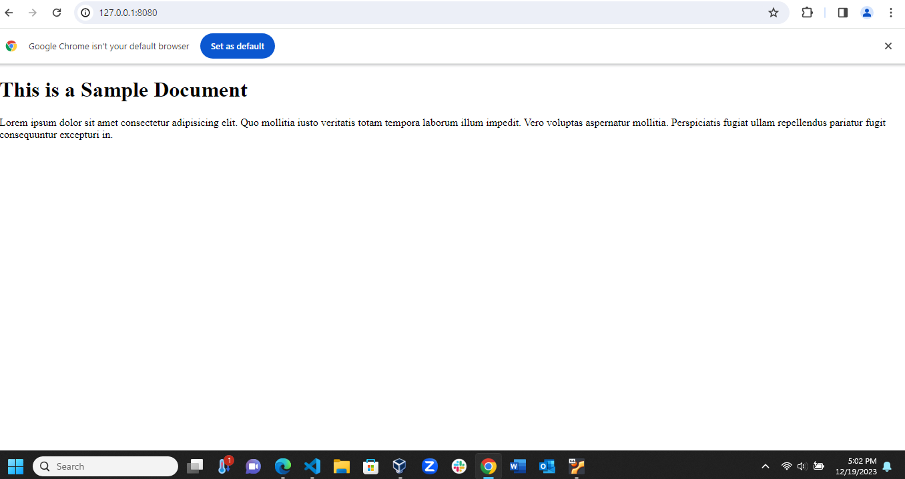

# Deliverable 2 Submission

## Server Specifications

### Question 1
  

### Question 2

### Question 3
* **What is the IP address of your Ubuntu Server Virtual Machine?**
10.0.2.15

### Question 4
* **How do you enable the Ubuntu Firewall?**

sudo ufw enable
### Question 5
* **How do you check if the Ubuntu Firewall is running?**
 sudo systemctl status apache2 

### Question 6
* **How do you disable the Ubuntu Firewall?**
sudo ufw disable

### Question 7
* **How do you add Apache to the Firewall?**
Before we can setup SSH, we need to enable the firewall
configure ufw to allow Apache and SSH traffic
check the status of the 
check the status of Apache and SSH to make sure they are running

### Question 8
* **What is the command you used to install Apache?**
sudo apt install apache2

### Question 9
* **What is the command you use to check if Apache is running?**
sudo systemctl status apache2

### Question 10
* **What is the command you use to stop Apache?**
sudo systemctl stop apache2

### Question 11
* **What is the command you use to restart Apache?**
sudo systemctl restart apache2

### Question 12
* **What is the command used to test Apache configuration?**
The command used to test the Apache configuration is apachectl configtest

### Question 13
* **What is the command used to check the installed version of Apache?**
sudo apache2 -v

### Question 14
* **What are the most common commands to troubleshoot Apache errors? Provide a brief description of each command.**
    * sudo apachectl -t:Use the following command to test the Apache configuration for any syntax or system errors
    * sudo systemctl restart apache2: Use one of the following commands to perform a restart

### Question 15
* **Which are Apache Log Files, and what are they used for? Provide examples and screenshots.**
Apache Log Files are files that contain information about the activity and performance of an Apache web server, as well as any problems that may be occurring 1
