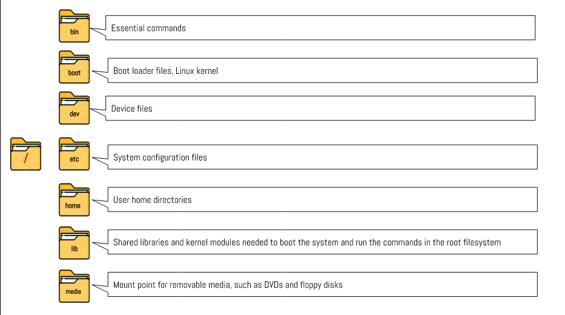

# Week Report 4

## PRACTICE FROM THE PRESENTATION THE LINUX FILE SYSTEM:

### practice 1

### practice 2

### practice 3

## THE LINUX FILE SYSTEM DIRECTORIES AND THEIR PURPOSE:

## ALL THE COMMANDS FOR NAVIGATING THE FILESYSTEM

| Command | What it does                            | Syntax | Example |
| ------- | --------------------------------------- | ------ | ------- |
| pwd     | prints current directory                | pwd    | 'pwd'   |
| cd      | changes the current working directory   | cd     | 'cd'    |
| ls      | list all files inside a given directory | ls     | 'ls'    |

## Basic terminology

* **File system** The way files are stored and organized.

* **Current directory** The directory where are you at the moment.
* **parent directory** You are always working inside a particular directory and you can move forward to a subdirectory or backwards to the directory.
* **the difference between YOUR HOME directory and THE HOME directory** the HOME directory is the default directory for a user when they log in. It is also known as the user’s home directory and is represented by ~. The HOME directory contains the user’s personal files, settings, and configurations. YOUR HOME directory is a subdirectory within the HOME directory that is created for each user. It is represented by ~/ followed by the username. This subdirectory contains files and directories that are specific to that user.
* **pathname** Every file has a pathname which indicates the location of the file in the filesystem.
* **relative path** The location of a file starting from the current working directory that is located inside the current working directory.
* **absolute path** The location of a file starting from the current working directory that is located inside the current working directory.

