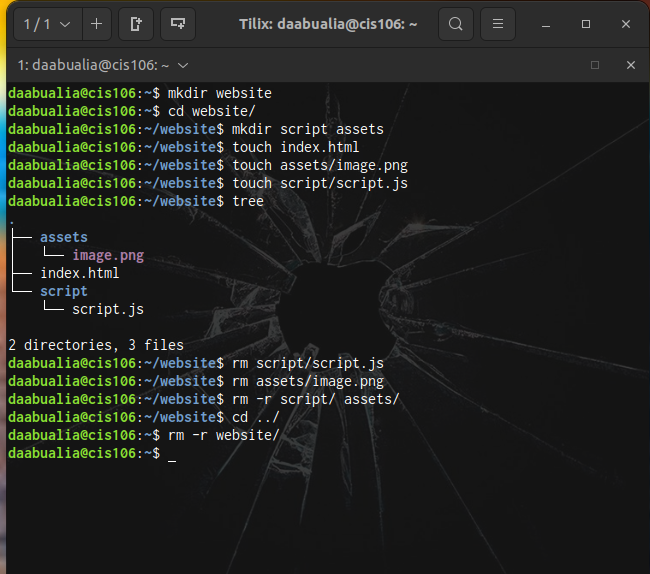
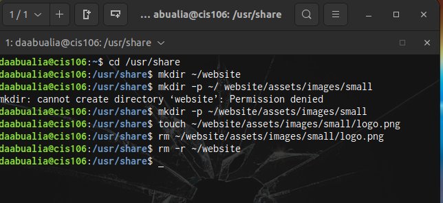
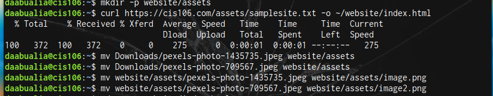

# Week report 5

## Answer to questions.

* **What are Command Options?**
  Commands are often followed by options that modify/enhance their behavior.
* **What are Command Arguments?**
  which are the items the command acts on.
* **Which command is used for creating directories? Provide at least 3 examples.**
 the command is mkdir
 * example 1:
        *mkdir apple
* example 2 :
   * mkdir apple ~/Downloads/music/
* example 3 :
     * mkdir orange ~/Documents/labs 
* **What does the touch command do? Provide at least 3 examples.**
  touch command is used for creating files
* example 1:
     * touch list
* example 2:
    touch ~/Downloads/games.txt
* example 3:
    * touch Downloads/games2.txt
* **How do you remove a file? Provide an example.**
  Remove a file with the rm command.
* Example: rm apple
* **How do you remove a directory and can you remove non-empty directories in Linux? Provide an example**
  To remove a directory u can use rmdir . Yes you can remove a non empty directories in linux using rm -r command.
* Example : rm -r Downloads/games
* **Explain the mv and cp command. Provide at least 2 examples of each**
 * mv command moves and renames directories. for example :
     * mv downloads/text.pdf Documents/
     * mv Downloads/pics /usr/share/themes
 * cp command to copies files and directories from a source to a destination.
     * cp Downloads/wallpapers.txt Document/
     * cp -r ~/Document/docs ~/ Downloads/
  

  ### Practice 1 
  

  ### Practice 2 
  

  ### practice 3 
  

  ### practice 4
  

  
