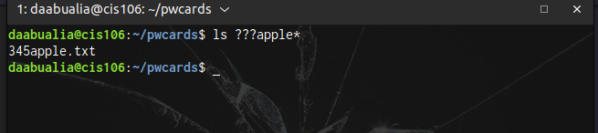
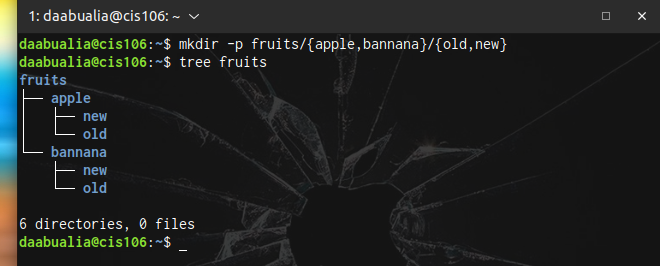
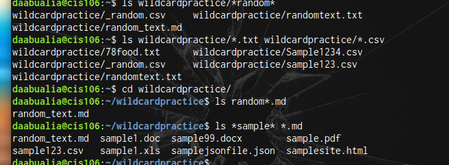
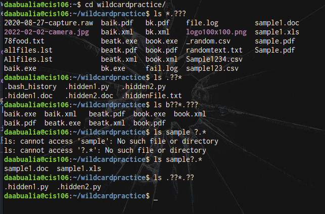
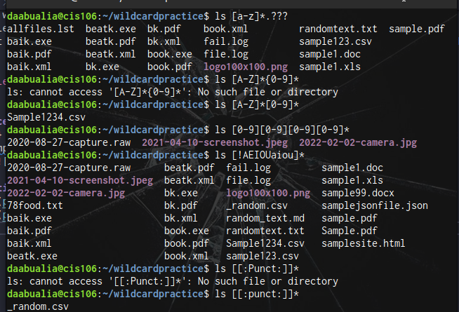

# Week report 6

## Wildcards.
the * wildcard matches from 0 to any number of characters.
* Examples:
    * List all the text file in a directory.
        * 'ls *.txt'
    * List all the files that start with the word file.
        * 'ls file*
    * Copy all the mp4 files
        * cp Downloads/*.mp4 ~/Videos/Movies/'

### ? Wildcards
* The ? wildcard matches a single characters.
* Example
  * list all the files that have 3 characters and are followed by the word apple in the name.

### Brace Expansion
* The {} brace expansion is another feature of bash that allows you to generate arbitrary strings to use with commands.
  * ExampE:
     * 

## practice 5

## practice 6 

## practice 7

